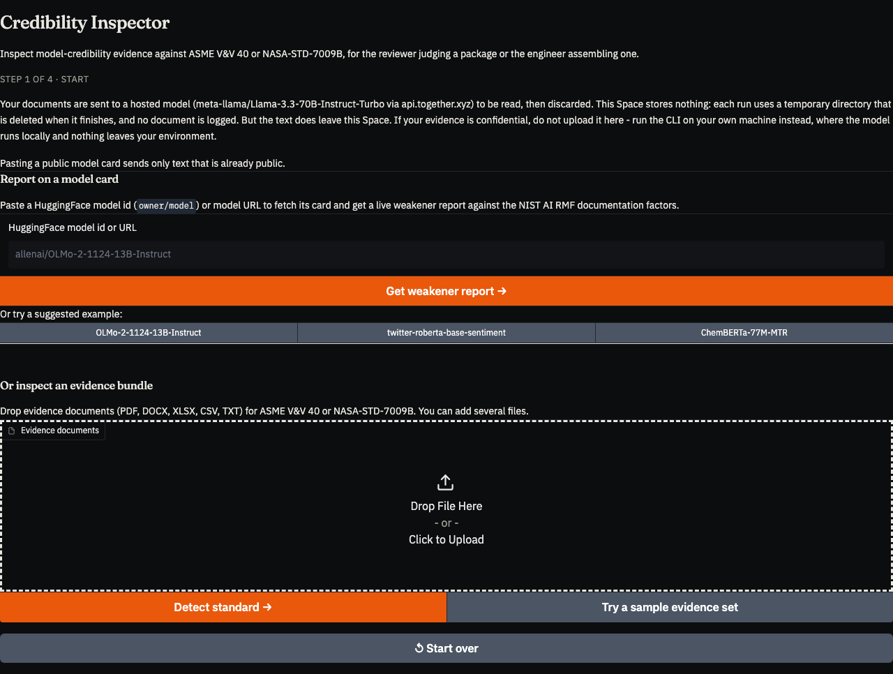
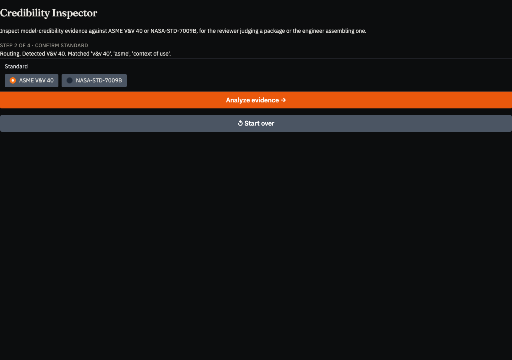
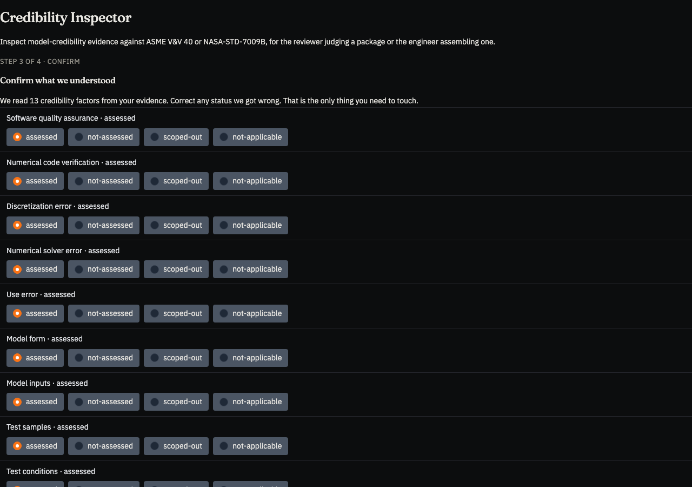
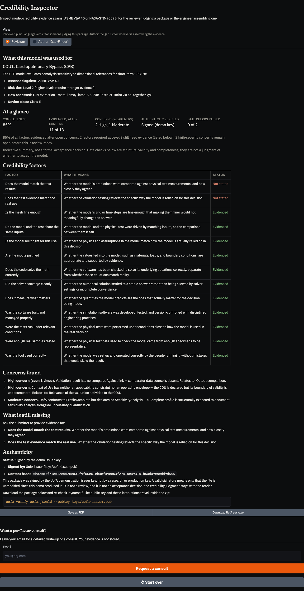
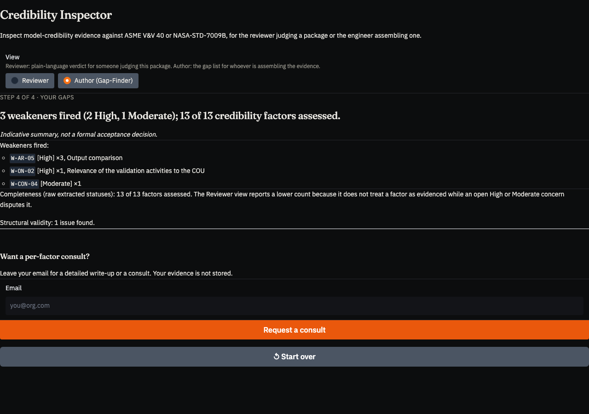

# The Credibility Inspector

The Credibility Inspector is the usability layer over the UofA toolchain. It is
live at [uofa.net/demo](/demo/), backed by a HuggingFace Space, and it runs the
same code the command line runs.

Its design claim is narrow and testable: **a practitioner can produce and read a
Unit of Assurance without learning what one is.** No RDF, no SHACL, no JSON-LD,
no signatures, no vocabulary. Upload evidence, confirm what the tool understood,
read the result.

This document states that claim, shows the flow that implements it, marks
exactly where human judgment enters, and records what has and has not been
demonstrated.

## 1. What the claim means

"Hidden complexity" is easy to assert and easy to fake, so it is worth fixing
what would falsify it.

The Inspector satisfies the claim if a user completing an assessment is never
required to:

- know that the artifact is a graph, or that the graph is RDF;
- read or write any vocabulary term (`hasCredibilityFactor`, `factorStatus`);
- understand SHACL, the rule engine, or what a weakener is, in order to act on
  one;
- handle a key, a hash, or a signature to obtain a verifiable package.

And it fails if any of those leak into the flow.

The user's total obligation is one thing: **confirm or correct the credibility
factor statuses the tool read.** Everything else — routing to a standard,
mapping to a graph, structural validation, rule evaluation, signing — happens
without being surfaced as a task.

The corresponding cost is stated in §6, and the limits in §7. The claim is about
the interface, not about the extraction being correct.

## 2. The flow

Four steps. Each figure is captured from the deployed Space by
`dev/tools/scripts/capture_inspector_screenshots.py`, which drives the real
pipeline against the bundled public sample, so the figures can be regenerated
after any change rather than maintained by hand.

### Step 1 — Start



The user supplies evidence, or a public model card identifier, or takes the
bundled sample. The disclosure about where documents are processed sits above
the file picker rather than below it, because a disclosure a user meets after
uploading is not a disclosure (§6).

### Step 2 — Confirm the standard



A keyword router reads the corpus and proposes a standard (ASME V&V 40 or
NASA-STD-7009B), showing its reasoning. The user can override it.

When the routing signal is weak the tool refuses to auto-advance: the button is
disabled until the user chooses explicitly. A confident guess on thin evidence
would be the same failure the whole project is about.

### Step 3 — Confirm what the tool understood



The tool presents every credibility factor it read, with the status it assigned
and a "what we read" panel giving the plain-language gloss and the rationale it
extracted. The user corrects anything wrong.

This is the only editable surface in the flow, and it is the subject of §3.

### Step 4 — Read the result



One analysis, two readings (§4), plus the downloadable package (§5).

## 3. Human adjudication role

*This section supports the human-adjudication disclosure (must-have 5).*

All adjudication in this work was performed by the author. The programme's
no-external-contributor constraint precludes independent reviewers, and that is
a limitation of the study rather than a design choice. The mitigations are the
published adjudication protocol, the label-class partition that confines author
judgment to the JUDGMENT class, and the self-consistency study.

The Inspector contributes something those mitigations cannot: **a place to
point.** Step 3 is the adjudication step, and it is:

- **Bounded.** Factor status is the only user-mutable field. The user cannot
  edit rationales, levels, entities, validation results, or the decision record.
  Whatever the human contributes to the result, it contributed *there*.
- **Visible.** The step is not a hidden review pass. It occupies a numbered step
  of a four-step flow and cannot be skipped.
- **Identical to the study workflow.** The Space calls the same functions as the
  command line. There is no demo-only adjudication path.
- **Recorded.** Each factor in the emitted package carries a `statusProvenance`
  value saying whether the status is the model's or the human's.

That last property was added because the disclosure was otherwise unfalsifiable
from the artifact. Before it, a human correction silently replaced the extracted
value, and a reader holding a downloaded package could not tell which statuses
the model produced and which a person changed. The claim "judgment is bounded to
step 3" was true of the software and unverifiable from its output.

### Two classes, not three

`statusProvenance` records `extracted` or `corrected`. It deliberately does not
record `confirmed`.

The interface pre-fills every status from the extraction and the user submits the
form. An unchanged factor is therefore one the user may have read and agreed
with, or may have scrolled past. Recording that as `confirmed` would assert an
act of judgment the interaction does not evidence. `extracted` claims only what
is true: the model produced this value and no human moved it.

This matters for reading any adjudicated figure. "13 of 13 confirmed" would
suggest thirteen judgments; what actually occurred may be one judgment about the
set. The artifact should not inflate that, and does not.

The field is emitted only where a confirmation step actually ran. A package built
from a spreadsheet cannot know which cells a human touched, and there the honest
answer is silence rather than a guess — the same rule the package already applies
to its other provenance classes.

## 4. One analysis, two readings

The same analysis is rendered two ways: a **Reviewer** view for someone deciding
whether to trust a finished package, and an **Author (Gap-Finder)** view for
whoever is assembling the evidence.



The toggle switches presentation only. It runs nothing and recomputes nothing.

This is enforced rather than intended. Both views derive from a single state
object built once, with invariants asserted at construction. The discipline
exists because an earlier build rendered *contradictory verdicts for the same
package* across the two views — the reviewer summary and the author gap list
disagreed about whether the same COU was adequately evidenced. Deriving twice
from one payload is enough to permit that; the protocol is documented in
`docs/reviewer-render-protocol-spec.md`.

The readout also declines to issue a verdict. It reports completeness, gaps and
weakener concerns, and states explicitly that it is indicative rather than a
formal acceptance decision. Acceptance is a human decision, and the tool does not
have the standing to make it.

## 5. The package

"Download UofA package" emits the assurance package itself, not only a report.

The zip contains the signed JSON-LD graph with its provenance, a rendered report,
a manifest, the public key, and verification instructions. The graph is the
artifact; everything else is a convenience copy. A recipient checks it with:

```bash
unzip uofa-pack-*.zip
uofa verify uofa.jsonld --pubkey keys/demo-reviewer.pub
```

It is built by the same code path as the command line's `uofa import`, and a
package produced by the web flow is accepted by the CLI verifier. That property
is enforced by a test that drives one input through both paths and fails if the
resulting digests diverge, so the web path cannot quietly become a fork.

### What a signature here does and does not mean

The demo signs with a **demonstration issuer key**, not a research or production
key, and deliberately not the default trust anchor: `--pubkey` is required. A
package from the demo therefore cannot be mistaken for a formally issued one.

A valid signature means the file is unmodified since the demo produced it. It is
not a review and not an acceptance decision. The readout says so in the same
panel that displays the signature, because a green "verified" badge beside a
content hash invites exactly the inference the project exists to discourage.

The public key travels inside the zip so verification works offline. A trust
anchor shipped inside the artifact it validates proves only self-consistency, so
its fingerprint is published independently in `space/README.md` and on the site.

Implementation notes, including the hash-stability constraint that governs
package verification, are recorded with the code rather than here: see
`tests/test_context_pin.py` and `space/DEPLOY.md`.

## 6. What usability cost

Extraction runs on a hosted model. The Space carries no local model, and that
buys the responsiveness the flow depends on — an analysis completes in seconds
rather than minutes — at a price that has to be stated rather than absorbed.

**Documents uploaded to the demo are sent to a third party** to be read. The
Space itself stores nothing: each run uses a temporary directory deleted when it
finishes, and no document is logged. But the text leaves the Space, and the
provider's terms govern what happens to it there. Suppressing our own logging
says nothing about theirs.

This is disclosed before upload, not after, and the readout names the extractor
that read the evidence so the disclosure survives into the artifact rather than
living only on the page.

**The privacy-preserving configuration is the command line**, and it is not a
downgrade. The CLI accepts any OpenAI-compatible endpoint, so the same model can
be served from a private deployment:

```bash
uofa extract ./evidence --pack vv40 \
  --extract-backend openai-compatible \
  --extract-base-url http://localhost:8000/v1 \
  --extract-model meta-llama/Llama-3.3-70B-Instruct
```

Nothing leaves the operator's environment, and the extraction path is identical
to the demo's. A smaller local model runs the same way through the `ollama`
backend. See `docs/llm-config.md`.

The demo is a demonstration artifact. Anyone assessing confidential evidence
should run the CLI.

## 7. Limits

### The detection score does not measure extraction quality, and we can show it

Scored against a corpus of **synthetic** assessment bundles (30 development + 20
held-out), **raw** extraction by `meta-llama/Llama-3.3-70B-Instruct-Turbo` gives —
**no adjudication step**, meaning no human corrected a factor status between
extraction and scoring, so these are the model's unaided numbers rather than the
practical ceiling a user with the confirm step would reach:

| split | bundles | mean overall F1 | **null control** | groundedness (coverage / claim density / grounded) |
|---|---|---|---|---|
| held-out test | 20 | 0.9544 | **0.9544** | 1.000 / 0.216 / 1.000 |
| development | 30 | 0.9637 | **0.9637** | 1.000 / 0.188 / 0.982 |

The null control is `control_constant_list`: emit the pack's fixed checklist of
factor names, having read no input at all. It ties the extractor to four decimal
places on both splits. **This metric cannot distinguish reading the document
from not reading it**, so it can neither support nor refute a claim about
extraction quality, and it is reported here to gate nothing.

Earlier revisions of this page gave 0.8909 and 0.9035 for these splits without
the control beside them, and described the held-out figure as clearing its
threshold. Both numbers were real and both were misleading, in two ways worth
stating plainly:

- They sat **below** their null controls (0.9544 and 0.9637), which was not
  disclosed because the controls were not reported.
- On the NASA half of each corpus they were measuring a routing bug, not
  extraction. `uofa extract --pack nasa-7009b` was sending the model the ASME
  V&V 40 prompt, so six of the nineteen NASA factors were never asked about and
  scored 0.000 each. Fixed; the NASA half moves 0.8385 to 0.9588 on dev and
  0.8167 to 0.9436 on test, and the V&V 40 half does not move at all. See
  `studies/nasa-prompt-routing/FINDINGS.md`.

Both figures stay on this page. The pairing — a score, beside a control that
equals it — is the disclosure, not a footnote to it.

Groundedness is given as the triple and should be read as one. At a claim
density of 0.19–0.22, "groundedness 1.000" describes about a fifth of the
output, and it is close to tautological for an extractor that mostly quotes.

That is not a hypothetical caution. The migration to hosted inference cut the
corpus's checkable claims from 864 to 200 while coverage *rose* to 1.000 and
groundedness held at 0.99. Two of the three numbers moved the reassuring way
while three quarters of the verifiable content disappeared. Reported alone,
either one would have described that as an improvement. The same run shows
`acceptance_criteria` distinctness across documents falling from 0.937 to 0.443
— the model writes one generic criterion per factor and reuses it everywhere,
which within-bundle counts cannot see. Both are open questions with declared
thresholds in `studies/hosted-model-specificity/FINDINGS.md`, and neither has
been scored against gold: what is established is that the field stopped varying
with the document, not that it is wrong.

These are **raw** figures: the scorer runs extraction and compares to ground
truth with no adjudication step. Adjudicated performance would be higher and
would measure something else — the practical ceiling of tool-plus-operator, not
the tool. All runs are single runs without seed control.

### On real documents, the rationales contain nothing to check

Everything above is the synthetic corpus. The same extractor, run over six
hand-annotated real engineering papers:

| | coverage | claim density | groundedness |
|---|---|---|---|
| synthetic (development) | 1.000 | 0.188 | 0.982 |
| **six real papers** | **1.000** | **0.000** | **0.000** |

**Every factor received a rationale. Not one of the 96 rationales contains a
single checkable number.** They read like this:

> *"The grid convergence study showed that the discretization error was small."*
> *"The software is widely used and has been validated by other users."*

Well-formed, plausible, and unverifiable — in documents that are full of the
figures they are describing. Distinctness is 0.417, so roughly three in five
rationales restate another in the same document.

This is why the triple is always reported as a triple. Read alone,
`coverage 1.000` says every factor was addressed. Read alone,
`groundedness 0.000` says the tool fabricated everything. Both are wrong, and
the truth is only visible in the middle number.

**What it means for a reviewer:** on a real paper this tool currently tells you
*which* factors it thinks the evidence covers, and gives you prose that cannot
be checked against the document. The factor mapping is the part to trust; the
rationale is a starting point for your own reading, not a citation.

### The replacement criterion was measured, and not cleared

A replacement for the detection gate — attribution against a battery of nulls,
plus the groundedness triple — was specified with numeric thresholds committed
before it ran, and then measured on those six real papers.

**It did not clear.** The margin over its own permutation null was +0.044 at
0.5 standard deviations, against a required 0.25 and 3.0. Three correct
attributions in 56, all from the shortest paper; five of six papers scored zero.

Underneath the failed gate there is measurable capability: 5.5× the run's own
chance level on real prose, 8.6× on synthetic, and no null reaching it at any
rationale length. That is a characterization, not a pass.

**The sample is the limit on what can be concluded.** Fifty-six factor-document
pairs, six papers, one annotator, whose own same-sentence agreement with an
independent second reader is 0.714. At that size nothing distinguishes a
mechanism from noise, and no change to the tool moves that wall — only more
annotated documents and a second annotator do.

So the honest statement of what this tool's extraction is known to do: it maps
factors at ceiling on a measure that a constant also reaches, it attributes
evidence measurably better than chance and below the bar we set for resting a
claim on it, and on real documents it writes rationales a checker cannot check.
All three are published here because a tool that argues credibility should be
evidenced rather than asserted has to hold itself to that first.

### A failure mode found by testing, not by reasoning

During the migration to a hosted model, the extractor was given a shopping list
as an evidence corpus. It returned all thirteen credibility factors marked
`assessed`, while its own rationales read "no evidence of software quality
assurance found in the provided documents." Because status drives the
completeness computation, the readout reported a fully evidenced assessment of a
shopping list.

The cause was placement, not absence: the rule requiring absence to yield
`not-assessed` existed, fourteen lines below the field specification it governed,
among eight other rules. Restating it at the point of use, in terms of the
specific contradiction, fixed the behaviour.

Two things follow that matter more than the fix. First, **the guard was
prompt-level, so it is model-dependent**: the previously configured local model
did not exhibit the failure, and a future model may reintroduce it. Second, the
failure was invisible to the accuracy metrics — F1 is unchanged before and after,
because no corpus in the evaluation set contains a case where the correct answer
is "no evidence."

### What has not been demonstrated

- **The absence behaviour is not corpus-validated.** No available corpus has
  `not-assessed` ground truth; the statuses are `assessed` and `not_applicable`,
  which is a different claim. The fix is verified on four hand-constructed cases
  and by the reasoning above, not by a scored evaluation.
- **The interface claim is not user-tested.** §1 argues the design from what the
  interface requires of a user. No usability study was conducted, and no external
  practitioner has completed the flow under observation.
- **Roughly one in five extracted factors carries no status at all** in the
  evaluation runs, independent of the prompt change. Status is the field the
  completeness computation and the headline depend on, so this is a real gap in
  the extraction path and is unresolved.
- **Adjudication is single-author** (§3).

## Reproducing

The figures: `python dev/tools/scripts/capture_inspector_screenshots.py`.

The extraction figures: `dev/tools/scripts/score_extraction_batch.py` against
`tests/fixtures/extract_corpus/`. The held-out split is sentinel-locked and
requires an explicit flag. Raw results are retained in `studies/prompt-absence/`.
